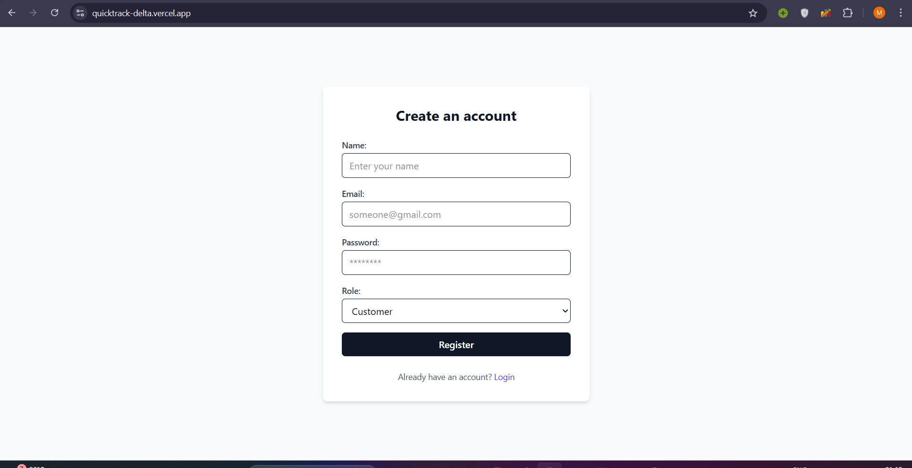
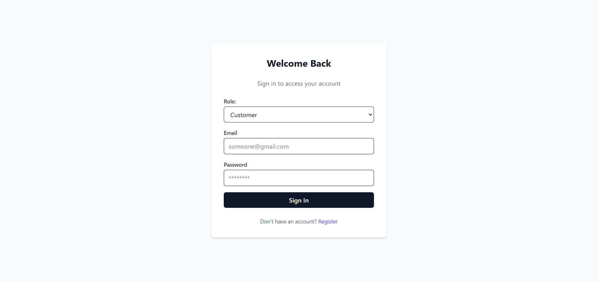
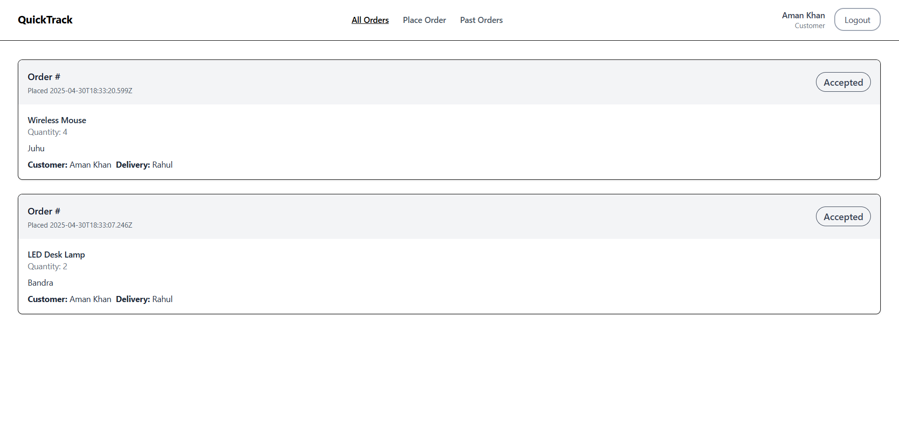
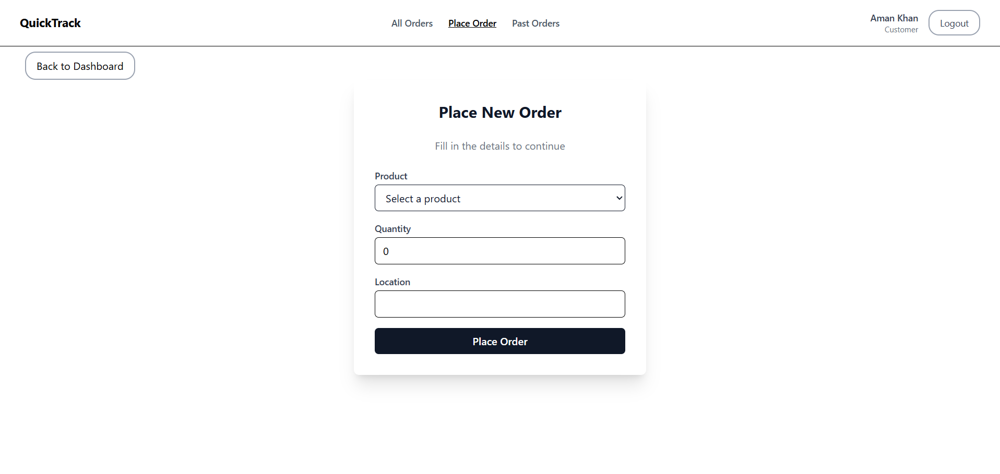
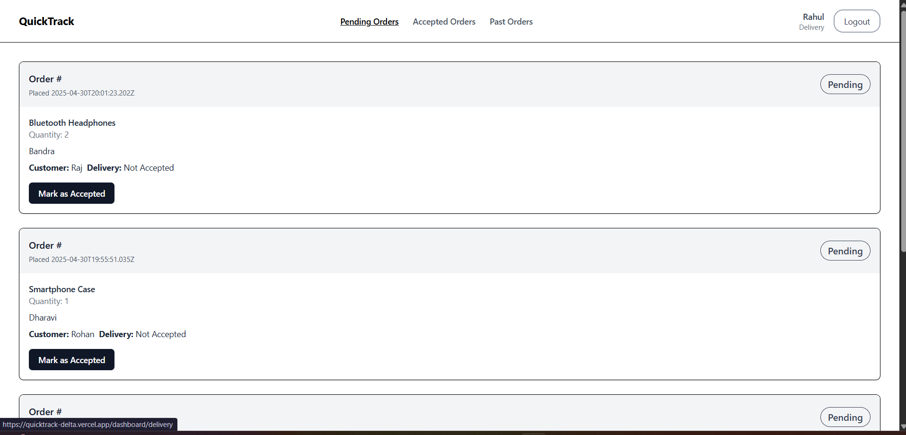

# Quick Commerce Order & Delivery Tracking System

A full-stack application for placing, managing, and tracking real-time delivery orders. Built with **Next.js**, **MongoDB**, **JWT authentication**, and **Socket.io** for live updates.

---

## Tech Stack

- **Frontend:** React.js, Next.js (App Router)
- **Backend:** Next.js API Routes
- **Authentication:** JWT
- **Database:** MongoDB + Mongoose
- **Real-Time:** Socket.io
- **Deployment:** Vercel and Render

---

## Setup Instructions

### 1. Clone the Repository

```bash
git clone <your-repo-url>
cd your-project-name
```

### 2. Install Dependencies

```bash
npm install
```

### 3. Environment Variables

Create a `.env.local` file at the root:

```env
MONGODB_URI=your_mongodb_connection_string
JWT_SECRET=your_secret_key
```

### 4. Run the App

```bash
npm run dev
```

The app will be live on `http://localhost:3000`.

---

## Folder Structure Overview

```
src/
├── app/
│   ├── api/
│   │   ├── auth/              # Register, login, fetch user
│   │   ├── orders/            # Order creation, status updates, fetching
│   │   ├── product/           # Fetch all products
│   ├── login/                 # Login page
│   ├── register/              # Register page
│   ├── dashboard/
│   │   ├── layout.js          # Navbar + role-based layout
│   │   ├── customer/
│   │   │   ├── page.js        # Current orders list
│   │   │   ├── place-order/   # Place order form
│   │   │   └── history/       # Past orders
│   │   ├── delivery/
│   │   │   ├── page.js        # Pending orders
│   │   │   ├── accepted/      # Accepted orders
│   │   │   └── history/       # Past orders
├── lib/
│   ├── auth.js                # JWT sign and verify
│   ├── db.js                  # MongoDB connection
│   └── middleware/
│       └── authGuard.js       # JWT middleware for API protection
├── models/
│   ├── user.js
│   ├── product.js
│   └── order.js
├── socket/                    # Socket server & client handlers
```

---

## Authentication

- **Register:** `POST /api/auth/register`
- **Login:** `POST /api/auth/login`
- **Get Current User:** `GET /api/auth/me` (JWT in headers)

---

## 📦 Order APIs

- **Create Order (Customer)**  
  `POST /api/orders`

- **Customer Orders List**  
  `GET /api/orders/customer`

- **Order Status Update (Delivery)**  
  `PUT /api/orders/[id]/status`

- **Fetch Accepted Orders (Delivery)**  
  `GET /api/orders/accepted`

- **Pending Orders (All)**  
  `GET /api/orders/pending`

- **Past Orders (Customer/Delivery)**  
  `GET /api/orders/history`

---

## WebSockets

- Socket server initialized in `socket/`.
- Delivery partner emits order status updates.
- Server broadcasts status to all clients.
- Customer receives real-time updates on their orders.

---
## Screenshots

**Register Page**
 

**Login Page** 
 

**Orders Listing Page** 
 

**Create Order (Customer)** 
 

**Update Order (Delivery Partner)** 
 

---

## App Flow Summary

### **Login & Registration**

- JWT-based authentication.
- Roles: `customer`, `delivery`.

### **Customer Flow**

1. Register/Login.
2. Place an order from the **Place Order** page.
3. View current order status in real-time.
4. View past orders on **History** page.

### **Delivery Partner Flow**

1. Register/Login.
2. View all **Pending Orders**.
3. Accept orders and update status: `Accepted → Out for Delivery → Delivered`.
4. View **Accepted** and **Past Orders**.

---

## Deployment 

- Next.js Full Stack deployed on vercel.
- Socket deployed on render.

---